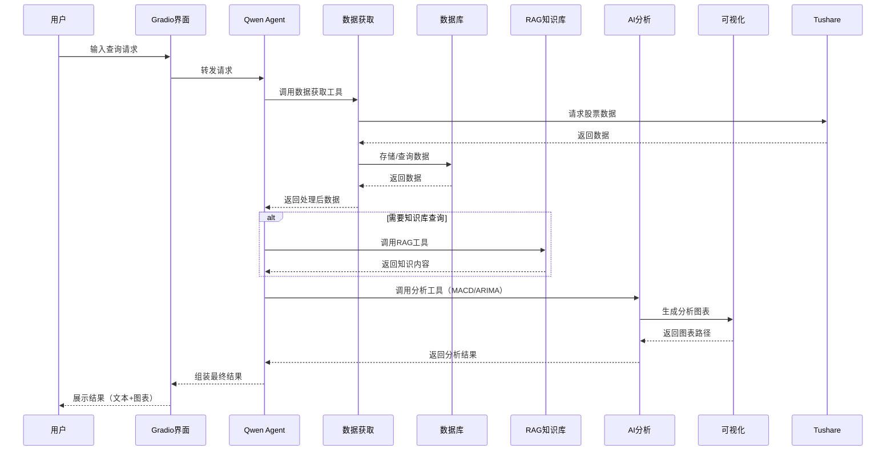

# 📊 股票分析助手项目架构

## 1. 项目概述
股票分析助手是一个集成了**数据获取、AI分析、RAG知识库、可视化展示**的交互式BI报表工具，帮助用户获取股票历史数据、进行技术分析（如MACD）、生成交易信号并提供AI驱动的投资建议。

## 2. 目录结构
```
├── stock_analysis_assistant-3.py  # 主程序入口（集成Web界面）
├── stock_analysis_assistant-2.py  # 历史版本
├── stock_analysis_assistant.py    # 原始版本
├── stock_data_downloader.py       # 股票数据下载器（Tushare API封装）
├── create_stock_table.sql         # MySQL数据库表结构定义
├── requirements.txt               # Python依赖包清单
├── README.md                      # 项目说明文档
├── PROJECT_ARCHITECTURE.md        # 项目架构文档
├── faq.txt                        # RAG知识库文件
├── stock_charts/                  # 生成的图表文件
├── stock_historical_data_*.xlsx   # 历史数据Excel文件
├── check_excel_fields.py          # Excel字段检查工具
├── workspace/                     # 工作目录（工具存放）
│   └── tools/                     # 辅助工具目录
│       ├── doc_parser/            # 文档解析工具
│       └── simple_doc_parser/     # 简易文档解析工具
├── run.bat                        # Windows运行脚本
├── run.ps1                        # PowerShell运行脚本
└── test_macd_error.py             # 功能测试文件
```

## 3. 核心模块架构

```
┌───────────────────────────────────────────────────────────────────────────────────┐
│                                股票分析助手系统                                    │
├─────────────┬─────────────┬─────────────┬─────────────┬─────────────┬─────────────┤
│  数据获取层  │   数据存储层  │   AI分析层   │  RAG知识库   │  可视化层    │  用户界面层  │
├─────────────┼─────────────┼─────────────┼─────────────┼─────────────┼─────────────┤
│ Tushare API │  MySQL数据库  │ Qwen Agent  │  faq.txt    │ Matplotlib  │  Gradio Web │
│ Tavily API  │  Excel文件    │ DashScope   │  Doc Parser │              │   界面      │
└─────────────┴─────────────┴─────────────┴─────────────┴─────────────┴─────────────┘
```

### 3.1 核心模块详细说明

#### 📥 数据获取层
- **Tushare API**：获取股票历史交易数据、基本面数据
- **Tavily API**：获取股票相关新闻资讯
- **数据清洗**：格式转换、缺失值处理、异常值过滤

#### 💾 数据存储层
- **MySQL数据库**：存储历史交易数据
  - 表结构：`all_symbols`（包含日期、开盘价、收盘价等10个字段）
- **Excel文件**：存储历史备份数据
- **内存缓存**：使用Pandas DataFrame进行数据处理和临时存储

#### 🤖 AI分析层
- **Qwen Agent**：实现智能对话、任务调度、工具调用
- **DashScope**：提供大模型推理能力
- **技术分析模块**：
  - MACD策略：计算MACD指标、生成买卖信号、回测绩效
  - ARIMA预测：时间序列分析、股票价格预测

#### 📚 RAG知识库
- **faq.txt**：股票知识问答知识库
- **文档解析工具**：解析和处理知识库文档
- **知识检索**：基于用户查询检索相关知识

#### 📈 可视化层
- **Matplotlib**：生成股票走势图、MACD策略图、ARIMA预测图
- **图表保存**：自动将生成的图表保存到`stock_charts/`目录
- **图表展示**：在Web界面中直接显示生成的图表

#### 🖥️ 用户界面层
- **Gradio Web界面**：提供交互式对话界面
- **会话管理**：支持多用户并发访问
- **结果展示**：显示分析结果、图表和AI建议

## 4. 数据流流程



## 5. 核心功能模块

### 5.1 MACD分析模块
```python
class MacdStockTool:
    def call()          # 主入口函数
    def get_historical_data()  # 获取历史数据
    def calculate_macd()       # 计算MACD指标
    def generate_trade_signals() # 生成交易信号
    def calculate_performance()  # 计算策略绩效
    def plot_macd_strategy()     # 绘制策略图表
    def format_result()          # 格式化输出结果
```

### 5.2 ARIMA预测模块
```python
class ArimaStockTool:
    def call()          # 主入口函数
    def get_historical_data()  # 获取历史数据
    def fit_arima_model()      # 拟合ARIMA模型
    def generate_forecast()    # 生成价格预测
    def plot_forecast()        # 绘制预测图表
    def format_result()        # 格式化输出结果
```

### 5.3 RAG知识库模块
```python
class RagStockKnowledgeTool:
    def call()          # 主入口函数
    def _search_knowledge()    # 知识库查询
    def _load_knowledge()      # 加载知识库
    def format_result()        # 格式化输出结果
```

### 5.4 数据工具模块
```python
# 数据库查询工具
def exc_sql():
    # 执行SQL查询

# 新闻搜索工具
def get_stock_news():
    # 调用Tavily API获取新闻

# Excel字段检查工具
def check_excel_fields():
    # 检查Excel文件字段完整性
```

## 6. 技术栈

| 技术类别 | 具体技术/框架 | 版本要求 | 用途 |
|---------|-------------|---------|------|
| 编程语言 | Python | 3.8+ | 核心开发语言 |
| 数据获取 | Tushare API | >=1.2.89 | 股票数据获取 |
| 数据获取 | Tavily API | >=0.3.0 | 新闻资讯获取 |
| 数据处理 | Pandas | >=2.0 | 数据清洗与分析 |
| 数据存储 | MySQL | - | 历史数据存储 |
| 数据存储 | openpyxl | >=3.1 | Excel文件处理 |
| AI框架 | Qwen Agent | >=0.3.0 | 智能对话与工具调度 |
| AI模型 | DashScope | >=1.16.0 | 大模型推理服务 |
| 可视化 | Matplotlib | >=3.7 | 图表生成 |
| Web框架 | Gradio | - | 交互式Web界面 |
| 技术分析 | StatsModels | >=0.14.0 | ARIMA模型 |
| 数学计算 | NumPy | >=1.24.0 | 数值计算 |
| 文档处理 | python-docx | - | 文档解析 |

## 7. 系统特点

### 7.1 优势
- **全流程自动化**：从数据获取到分析、可视化一键完成
- **AI驱动**：结合大模型提供智能分析和投资建议
- **RAG增强**：基于知识库提供更精准的股票知识回答
- **交互式体验**：通过Gradio提供友好的Web界面
- **可扩展架构**：模块化设计，易于添加新的分析工具

### 7.2 可扩展性
- 支持添加新的技术分析指标（如KDJ、RSI等）
- 可集成更多数据源（如新浪财经、东方财富等）
- 可扩展更多AI分析能力（如情感分析、事件驱动分析等）
- 可扩展知识库内容，提升回答的专业性

## 8. 部署与运行

### 8.1 环境配置
1. 安装依赖：`pip install -r requirements.txt`
2. 配置API密钥（从环境变量获取）：
   - Tushare API Key
   - Tavily API Key (TAVILY_API_KEY)
   - DashScope API Key (DASHSCOPE_API_KEY)
3. 配置数据库连接（修改代码中的数据库连接信息）

### 8.2 运行方式
- 直接运行：`python stock_analysis_assistant-3.py`
- 使用批处理：`run.bat`（Windows）
- 使用PowerShell：`run.ps1`

### 8.3 主要功能
- 股票基本信息查询（开盘价、收盘价、最高价、最低价等）
- 股票价格趋势分析
- 成交量和成交额分析
- 涨跌幅计算和统计
- 多股票对比分析
- 最新股票相关新闻查询
- ARIMA模型未来价格预测
- MACD指标交易策略分析
- 知识库问答（基于RAG）

---

**项目架构设计目标**：实现一个模块化、可扩展、易用的股票分析系统，结合数据驱动和AI智能分析，为用户提供全面的股票投资决策支持。